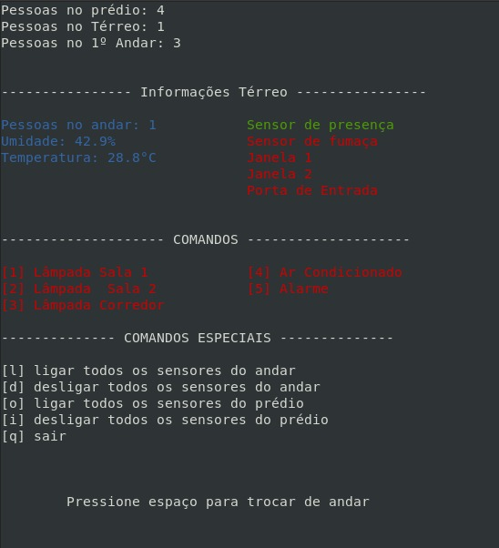

# Tabalho 2 - FSE

Este trabalho tem por objetivo a criação de um sistema distribuído de automação predial para monitoramento e acionamento de sensores e dispositivos de um prédio de 2 andares, mas com capacidade de aumento para mais andares.

De acordo com as especificações do trabalho, o sistema deve ser desenvolvido para funcionar em um conjunto de placas Raspberry Pi com um servidor central responsável pelo controle e interface com o usuário e servidores distribuídos para leitura e acionamento dos dispositivos. 
- monitoramento de temperatura e umidade
- sensores de presença
- sensores de fumaça
- sensores de contagem de pessoas
- sensores de abertura e fechamento de portas e janelas
- acionamento de lâmpadas, aparelhos de ar-condicionado, alarme e aspersores de água em caso de incêndio.

Descrição do trabalho: https://gitlab.com/fse_fga/trabalhos-2021_2/trabalho-2-2021-2.

## Instruções de compilação

Esse repositório contém os servidores distribuído e central. Para compilar cada um, entre no diretório do servidor que deseja compilar

```
cd servidor_central
```
ou
```
cd servidor_distribuido
```
após, compile o programa com o comando:

```
 make
```

## Execução

### Servidor Distribuído

O servidor distribuído espera um arquivo json como parâmetro para que possa carregar as informações do andar.

Para o problema proposto, estão disponíveis dois arquivos json no direitório "servidor_distribuido". 

- configuracao_andar_terreo.json
- configuracao_andar_1.json


Sendo assim, para executar o program:

```
make run FILE=<nome_do_arquivo>
```

### Servidor Central

Após a compilação do programa, basta: 

```
make run
```

## Uso 

### Servidor Distribuído

O servidor distribuído irá esperar conseguir fazer a conexão com o servidor central. Após realizar a conexão, ele irá encerrar caso a conexão seja perdida. 

### Servidor Central

- O servidor distribuído está configurado para escutar a porta **10061**

O servidor central irá esperar a conexão de ao menos 1 servidor distribuído. Após a conexão, será apresentada a tela de monitoramento do andar atual, como na imagem abaixo:




Na imagem, é possível observar 4 seções apresentadas para o usuário, as quais são separadas por linha tracejada. 

- A primeira seção: apresenta as informações gerais do prédio - número de pessos e o número de pessoas em cada andar. Além disso, de acordo com a interação do usuário, essa seção apresenta um status do sistema, sendo vermelho para erros e verde para solicitações aceitas (Ex. "Ligando lâmpada", "Desligando todos os sensores" etc.)

- Segunda seção: apresenta as informações específicas do andar sendo observado - umidade e temperatura no andar e o estado dos sensores do andar.
    
    - Verde: sensor ativo
    - Vermelhor: sensor desativado

- Terceira seção: apresenta a lista de comandos de acionamento de sensores e seus respectivos estados (Apenas o Térreo possui a opção de acionar o alarme de segurança).
    
    - Primeira seção com interação do usuário
    - O menu corresponde a um número e o sensor associado a ele
    - Se determinado sensor estiver vermelho e o usuário pressionar a tecla a ele associada, estará solcitando o acionamento do sensor. Caso esteja verde e o usuário pressione a tecla a ele associada, então estará solicitando o seu desligamento

    - **Exemplo de Uso** - Lâmpada Sala 1 está vermelho. Usuário deseja ligá-la. Pressione então a tecla 1. Se não houver nenhum erro de comunicação com o servidor distribuído referente ao andar, a lâmpada será ligada e sua nova cor será verde

- Quarta seção: Apresenta comandos especiais. 
    
    - Diferentemente da seção anterior, os comandos estão associados a letras específicas do teclado ("l", "d", "o", "i" e "q")
    - Não estão associadas a um sensor específico
    - Ao pressionar:
        - l - irá ligar todos os sensores do andar sendo observado
        - d - irá desligar todos os sensores do andar sendo observado
        - o - irá ligar todas as cargas do prédio
        - i - irá desligar todas as cargas do prédio
        - q - irá encerrar a conexão do servidor central e finalizar o programa 

<br>

- *Para alterar de andar a ser observado, pressione a tecla de espaço*